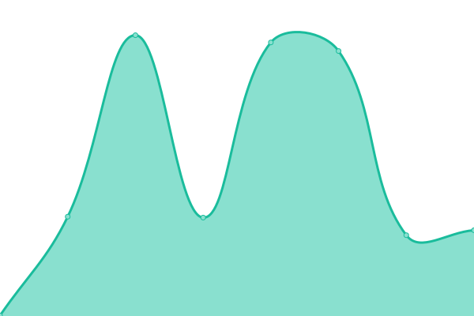
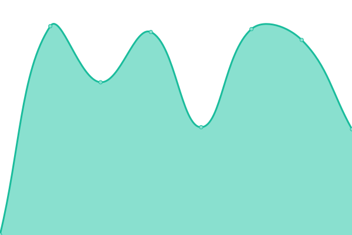
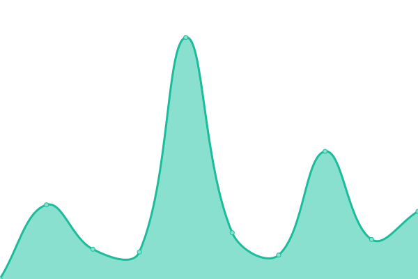
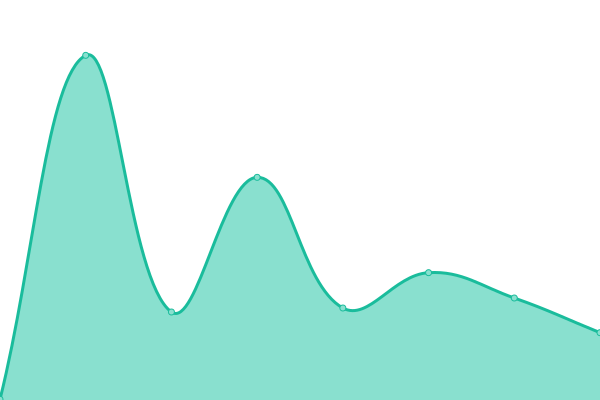
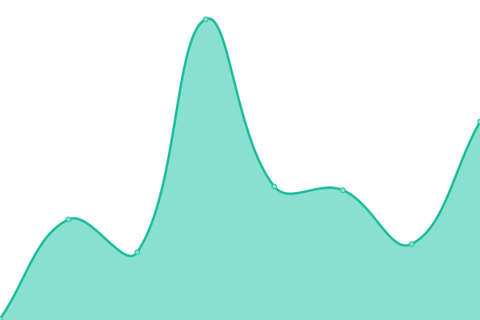

# [📈 Live Status](https://status.codechef.com): <!--live status--> **🟩 All systems operational**

This repository contains the open-source uptime monitor and status page for [CodeChef](https://www.codechef.com/), powered by [Upptime](https://github.com/upptime/upptime).

With [Upptime](https://upptime.js.org), you can get your own unlimited and free uptime monitor and status page, powered entirely by a GitHub repository. We use [Issues](https://github.com/codechef-org/status/issues) as incident reports, [Actions](https://github.com/codechef-org/status/actions) as uptime monitors, and [Pages](https://status.codechef.com) for the status page.

<!--start: status pages-->
<!-- This summary is generated by Upptime (https://github.com/upptime/upptime) -->
<!-- Do not edit this manually, your changes will be overwritten -->
<!-- prettier-ignore -->
| URL | Status | History | Response Time | Uptime |
| --- | ------ | ------- | ------------- | ------ |
|  [CodeChef](https://www.codechef.com) | 🟩 Up | [code-chef.yml](https://github.com/codechef-org/status/commits/HEAD/history/code-chef.yml) | 

 266ms
     
 | 

<a href="https://status.codechef.com/history/code-chef">99.88%</a>
    

|  [CodeChef Discuss](https://discuss.codechef.com) | 🟩 Up | [code-chef-discuss.yml](https://github.com/codechef-org/status/commits/HEAD/history/code-chef-discuss.yml) | 

 248ms
     
 | 

<a href="https://status.codechef.com/history/code-chef-discuss">100.00%</a>
    

|  [CodeChef Blog](https://blog.codechef.com) | 🟩 Up | [code-chef-blog.yml](https://github.com/codechef-org/status/commits/HEAD/history/code-chef-blog.yml) | 

 287ms
     
 | 

<a href="https://status.codechef.com/history/code-chef-blog">100.00%</a>
    

|  [CodeChef Goodies](https://goodies.codechef.com) | 🟩 Up | [code-chef-goodies.yml](https://github.com/codechef-org/status/commits/HEAD/history/code-chef-goodies.yml) | 

 317ms
     
 | 

<a href="https://status.codechef.com/history/code-chef-goodies">100.00%</a>
    

|  [CodeChef Business](https://business.codechef.com) | 🟩 Up | [code-chef-business.yml](https://github.com/codechef-org/status/commits/HEAD/history/code-chef-business.yml) | 

 213ms
     
 | 

<a href="https://status.codechef.com/history/code-chef-business">100.00%</a>
    

|  [CodeChef Certifications](https://certifications.codechef.com/data-structures-and-algorithms) | 🟩 Up | [code-chef-certifications.yml](https://github.com/codechef-org/status/commits/HEAD/history/code-chef-certifications.yml) | 

 215ms
     
 | 

<a href="https://status.codechef.com/history/code-chef-certifications">100.00%</a>
    

|  [CodeChef Campus](https://campus.codechef.com) | 🟩 Up | [code-chef-campus.yml](https://github.com/codechef-org/status/commits/HEAD/history/code-chef-campus.yml) | 

 758ms
     
 | 

<a href="https://status.codechef.com/history/code-chef-campus">100.00%</a>
    

|  [CodeChef API](https://api.codechef.com/urls) | 🟩 Up | [code-chef-api.yml](https://github.com/codechef-org/status/commits/HEAD/history/code-chef-api.yml) | 

 184ms
     
 | 

<a href="https://status.codechef.com/history/code-chef-api">100.00%</a>
    

<!--end: status pages-->

[**Visit our status website →**](https://status.codechef.com)

## 📄 License

- Powered by: [Upptime](https://github.com/upptime/upptime)
- Code: [MIT](./LICENSE) © [CodeChef](https://www.codechef.com/)
- Data in the `./history` directory: [Open Database License](https://opendatacommons.org/licenses/odbl/1-0/)
